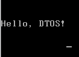

# Hello, DT〇S!
- 问题
    - 主引导程序是软件还是固件？
        > [软件]
    - 如果是软件, 那么由谁开发？如何开发？
        > [开发操作系统的程序员] [主引导程序是操作系统的一部分]

- 主引导程序
    - 一段存储在主引导区（MBR )中的有效代码
    - 并不固化于硬件，<font color=red>属于操作系统代码的一部分</font>
    - <font color=red>启动操作系统内核的桥梁</font>，由汇编程序写成
    - 代码总量不能超过 <font color=red>512</font> 个字节（<font color=red>包含 0x55aa</font> )

- 主引导程序的开发
    

- 课程实验
    - 编写一个主引导程序 (汇编语言）
    - 可独立运行于 x86 架构的主机（无操作系统）
    - 运行后在屏幕上打印"Hello, DTOS!"

- 实现思路
    1. 将关键寄存器的值设置为0 `( mov ax, 0 )`
    2. 定义需要打印的数据 `( db "Hello,D.T.OS!" )`
    3. 打印预定义好的字符数据 `( int 0x10 )`

- 汇编小贴士一
    - mov : 赋值操作，将右操作数赋值给左操作数
        ```x86asm
        mov ax, 0 ;将0赋值绐ax寄存器
        ```
    - int : 触发中断
        ```x86asm
        int 0x10 ;触发0x10号中断，对屏幕进行操作
        ```
    - hlt : 停止运行，CPU进入暂停状态，不执行任何操作
        ```x86asm
        hlt ;使程序进入睡眠状态
        ```

- 汇编小贴士二
    - 汇编中地址的访问方式：段地址：段内偏移地址
        ```x86asm
        mov byte [0xb800:0x01], 0x07 ; 0xb800:0x01 -> 0xb8000 + 0x01
        ```
    - 标签
        - 用于标识后续指令的地址（可等同为C语言中的标签(goto 标签)）
    -  `$` vs `$$`
        - `$` 表示当前指令行地址，`$$` 表示当前汇编段起始地址 (程序的起始地址, 比如主引导程序就是最开始的0x7c00)

- 中断调用 vs 函数调用
    - 在屏幕上打印一个字符
    

# [<u>编程实验 第一个引导加载程序</u>](code/002_Hello_DTOS)
代码编写

# 问题
- 如何验证编写的主引导程序？

- 解决方案设计
    - 将汇编源码编译为二进制机器码 ( <font color=red>nasm</font> )
    - 创建虚拟盘 ( <font color=red>bximage</font> )
    - 将二进制代码写入虚拟盘起始位置 ( <font color=red>dd</font> )
    - 在虚拟机中将虚拟盘作为启动盘执行 ( <font color=red>vmware</font> )

- 实验原材料
    - nasm (用这个编译器编译我们的汇编代码) (sudo apt-get install nasm)
        - `nasm boot.asm -o boot.bin`
    - bximage (用这个命令创建虚拟软盘, -fd:我们要创建的时虚拟软盘, 大小为1.44M, -q:不需要任何交互, 一次性的创建出a.img) (sudo apt-get install bximage)
        - `bximage a.img -q -fd -size=1.44`
    - dd (用这个命令将二进制的机器码,写入虚拟软盘, if:输入, of:输出到a.img这个虚拟软盘, bs:写入时每个单元大小512b, count:写入的单元个数, conv=notrunc:连续地写入,不要有任何间隔)
        - `dd if=boot.bin of=a.img bs=512 count=1 conv=notrunc`

# [<u>编程实验 运行引导加载程序</u>](code/002_Hello_DTOS)
- 实验环境 :
    1. VMware15.0.4
    2. Ubuntu 10.10 ( 查看Ubuntu版本 : lsb_release -a )
- 生成实验原材料

    ```
    $ ls
    boot.asm
    $ nasm boot.asm -o boot.bin
    $ bximage a.img -q -fd -size=1.44 // 可单独使用bximage配置参数
    ========================================================================
                                    bximage
                      Disk Image Creation Tool for Bochs
            $Id: bximage.c,v 1.34 2009/04/14 09:45:22 sshwarts Exp $
    ========================================================================
    I will create a floppy image with
      cyl=80
      heads=2
      sectors per track=18
      total sectors=2880
      total bytes=1474560

    Writing: [] Done.

    I wrote 1474560 bytes to a.img.

    The following line should appear in your bochsrc:
      floppya: image="a.img", status=inserted
    $ ls
    a.img  boot.asm  boot.bin
    $ dd if=boot.bin of=a.img bs=512 count=1 conv=notrunc
    记录了1+0 的读入
    记录了1+0 的写出
    512字节(512 B)已复制，0.000342366 秒，1.5 MB/秒
    ```

- 操作系统环境搭建
    - 创建虚拟机
        1. 打开VMware Workstation, 创建新的虚拟机
        2. 自定义 -> 下一步
        3. 硬件兼容性选择 Workstation 6.5-7.x -> 下一步
        4. 选择'稍后安装操作系统' -> 下一步
        5. 客户机操作系统:其他, 版本:其他 -> 下一步
        6. 虚拟机名:DTOS, 选择位置(xxx) -> 下一步
        7. 处理器数量:1, 每个处理器内核数量:1 -> 下一步
        8. 此虚拟机的内存:512M -> 下一步
        9. 选择'不使用网络连接' -> 下一步
        10. 默认推荐 ->下一步
        11. 默认推荐 -> 下一步
        12. 选择'创建新虚拟磁盘' -> 下一步
        13. 最大磁盘大小:32G, 选择'将虚拟磁盘存储为单个文件' -> 下一步
        14. 下一步
        15. 自定义硬件 -> 添加 -> 软盘驱动器 -> 完成 -> 关闭 -> 完成
    - 无操作系统启动虚拟机
        1. 开启此虚拟机, 下面提示选择否
        
        2. 虚拟机提示下面打印
        
    - 用制作的虚拟软盘启动
        1. 将上面制作的a.img拷贝到创建的虚拟机的目录(xxx)
        2. 打开VMware, 编辑DTOS虚拟机设置 -> 硬件 -> 软盘 -> 勾选'启动时连接' -> 使用软盘映像文件:选择a.img -> 确定
        3. 开启此虚拟机, 成功打印
        

# 小结
- 主引导程序的代码量不能超过 <font color=red>512</font> 字节
- 主引导程序需要使用 <font color=red>汇编语言</font> 开发
- 主引导程序中可以<font color=red>通过BIOS中断使用硬件功能</font>
- 主引导程序运行于实模式（<font color=#d0d>地址都是实际的物理地址</font>)
