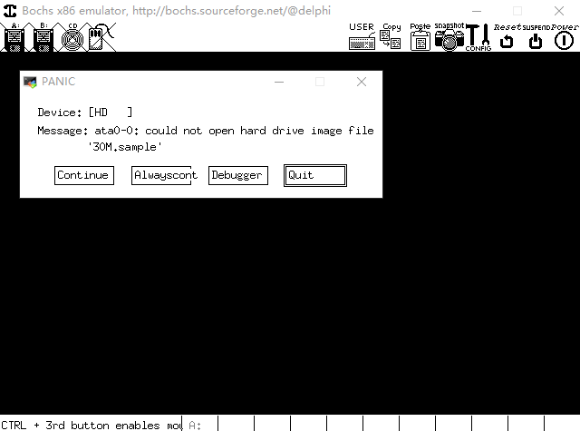

# 调试环境的搭建

- 问题
    如何调试主引导区的代码？

- Bochs (另一款优秀的虚拟机软件）
    - 专业模拟 `X86` 架构的虚拟机
    - <font color=red>开源</font>且高度可移植，<font color=red>由C++编写完成</font>
    - <font color=red>支持操作系统开发过程中的断点调试</font>
    - 通过简单配置就能够运行绝大数主流的操作系统(Windows, Linux,Unix)

- 支持调试功能的 Bochs 版本
    1. 下载源码：https://sourceforge.net/projects/bochs/files/
    2. 解压缩 bochs-2.x.x.tar.gz -> bochs-2.x.x
    3. 进入源码目录：cd bochs-2.x.x
    4. ./configure --enable-debugger --enable-disasm
    5. make
    6. sudo make install

# [<u>编程实验 Bochs的安装与配置</u>](code/003_调试环境的搭建)

- 解压缩
    ```
    $ cd tool/
    $ tar xzvf bochs-2.4.5.tar.gz
    ```

- 配置和编译 ( 配置时可能出现的问题 : [<u>problem.txt</u>](code/003_调试环境的搭建/problem.txt) )
    ```
    $ cd bochs-2.4.5/
    $ ./configure --enable-debugger --enable-disasm
    $ make
    $ sudo make install
    ```

- 直接运行,如下报错
    ```
    $ bochs
    > 6
    ```
    

# bochs 的配置
- 小贴士
    - 确定bochs的安装路径 ( `which bochs` )
    - 安装 vgabios ( `apt-get install vgabios` )
    - 确定 vgabios 的安装路径 ( `whereis vgabios` )

- Bochs 的启动文件
    - `megs:32` : 启动时,为操作系统分配 32M 的内存
    - `romimage:file=` : 镜像文件路径, 根据which bochs追踪
    - `vgaromimage:file=` : 镜像文件路径, 根据whereis vgabios追踪
        ```
        $ whereis vgabios
        vgabios: /usr/share/vgabios
        ```
    - `floppya:1_44=` : 这个虚拟机只有一个软驱, 大小是1.44M, 对应的虚拟软盘文件是(a.img)
    - `status=inserted` : 启动的时候,这张虚拟软盘已经插入虚拟机
    - `boot:floppy` : 从软驱启动
    - `mouse:enabled=0` : -
    - `keyboard_mapping:enabled=1` : -
    - `map=` : map文件路径, 根据which bochs追踪

    ```cfg
    # how much memory the emulated machine will have
    megs:32

    # filename of ROM images
    romimage:file=/usr/local/share/bochs/BIOS-bochs-latest
    vgaromimage:file=/usr/share/vgabios/vgabios.bin

    # what disk images will be used
    floppya:1_44=a.img, status=inserted

    # choose the boot disk.
    boot:floppy

    # where do we send log messages?
    # log: bochsout.txt

    # disable the mouse
    mouse:enabled=0

    # enable key mapping, using US layout as default.
    keyboard_mapping:enabled=1, map=/usr/local/share/bochs/keymaps/x11-pc-us.map
    ```

- 启动 bochs 虚拟机
    - 显示方式 ：`bochs -f bochsrc_file`
    - 隐式方式 ：`bochs`
        - 当前目录下的启动文件名 (按下面顺序依次查找)
            - <font color=red>.bochsrc</font>
            - <font color=red>bochsrc</font>
            - <font color=red>bochsrc.txt</font>

- 调试环境验证
    

# [<u>编程实验 Bochs 的验证</u>](code/003_调试环境的搭建)

- Bochs中的常用调试命令 (与GDB调试命令几乎一致)

|        命令         |        功能         |     示例      |
| ------------------- | ------------------- | ------------- |
| b (break)           | 设置断点             | b 0x7c00      |
| c (continue)        | 继续执行             | c             |
| s (step)            | 单步执行             | s             |
| info b (info break) | 查看当前所有断点      | info b        |
| info cpu            | 查看当前CPU状态      | info cpu      |
| r (reg)             | 查看常规寄存器状态    | r             |
| sreg                | 查看段寄存器状态      | sreg          |
| x /Nuf expression   | 查看内存中的数据      | x /2bx 0x7c00 |
| trace on[off]       | 开关 : 打印执行的指令 | trace on      |
| trace-reg on[off]   | 开关 : 打印寄存器的值 | trace-reg on  |

## 启动bochs
```
$ bochs
========================================================================
                       Bochs x86 Emulator 2.4.5
              Build from CVS snapshot, on April 25, 2010
========================================================================
00000000000i[     ] reading configuration from bochsrc
------------------------------
Bochs Configuration: Main Menu
------------------------------

This is the Bochs Configuration Interface, where you can describe the
machine that you want to simulate.  Bochs has already searched for a
configuration file (typically called bochsrc.txt) and loaded it if it
could be found.  When you are satisfied with the configuration, go
ahead and start the simulation.

You can also start bochs with the -q option to skip these menus.

1. Restore factory default configuration
2. Read options from...
3. Edit options
4. Save options to...
5. Restore the Bochs state from...
6. Begin simulation
7. Quit now

Please choose one: [6]6    // 选择6
00000000000i[     ] installing x module as the Bochs GUI
00000000000i[     ] Bochs x86 Emulator 2.4.5
00000000000i[     ]   Build from CVS snapshot, on April 25, 2010
00000000000i[     ] System configuration
00000000000i[     ]   processors: 1 (cores=1, HT threads=1)
00000000000i[     ]   A20 line support: yes
00000000000i[     ] CPU configuration
00000000000i[     ]   level: 6
00000000000i[     ]   SMP support: no
00000000000i[     ]   APIC support: yes
00000000000i[     ]   FPU support: yes
00000000000i[     ]   MMX support: yes
00000000000i[     ]   3dnow! support: no
00000000000i[     ]   SEP support: yes
00000000000i[     ]   SSE support: sse2
00000000000i[     ]   XSAVE support: no
00000000000i[     ]   AES support: no
00000000000i[     ]   MOVBE support: no
00000000000i[     ]   x86-64 support: no
00000000000i[     ]   MWAIT support: no
00000000000i[     ]   VMX support: no
00000000000i[     ] Optimization configuration
00000000000i[     ]   RepeatSpeedups support: no
00000000000i[     ]   Trace cache support: no
00000000000i[     ]   Fast function calls: no
00000000000i[     ] Devices configuration
00000000000i[     ]   ACPI support: no
00000000000i[     ]   NE2000 support: no
00000000000i[     ]   PCI support: no, enabled=no
00000000000i[     ]   SB16 support: no
00000000000i[     ]   USB support: no
00000000000i[     ]   VGA extension support: vbe
00000000000i[MEM0 ] allocated memory at 0xb514f008. after alignment, vector=0xb5150000
00000000000i[MEM0 ] 32.00MB
00000000000i[MEM0 ] mem block size = 0x00100000, blocks=32
00000000000i[MEM0 ] rom at 0xfffe0000/131072 ('/usr/local/share/bochs/BIOS-bochs-latest')
00000000000i[MEM0 ] rom at 0xc0000/38400 ('/usr/share/vgabios/vgabios.bin')
00000000000i[CMOS ] Using local time for initial clock
00000000000i[CMOS ] Setting initial clock to: Sun May 10 16:58:26 2020 (time0=1589101106)
00000000000i[DMA  ] channel 4 used by cascade
00000000000i[DMA  ] channel 2 used by Floppy Drive
00000000000i[FDD  ] fd0: 'a.img' ro=0, h=2,t=80,spt=18
00000000000i[VGA  ] interval=50000
00000000000i[MEM0 ] Register memory access handlers: 0x000a0000 - 0x000bffff
00000000000i[XGUI ] test_alloc_colors: 16 colors available out of 16 colors tried
00000000000i[XGUI ] font 8 wide x 16 high, display depth = 24
00000000000i[KMAP ] Loading keymap from '/usr/local/share/bochs/keymaps/x11-pc-us.map'
00000000000i[KMAP ] Loaded 168 symbols
00000000000i[MEM0 ] Register memory access handlers: 0xe0000000 - 0xe0ffffff
00000000000i[VGA  ] VBE Bochs Display Extension Enabled
00000000000i[     ] init_dev of 'unmapped' plugin device by virtual method
00000000000i[     ] init_dev of 'biosdev' plugin device by virtual method
00000000000i[     ] init_dev of 'speaker' plugin device by virtual method
00000000000i[SPEAK] Failed to open /dev/console: 资源暂时不可用
00000000000i[SPEAK] Deactivating beep on console
00000000000i[     ] init_dev of 'extfpuirq' plugin device by virtual method
00000000000i[     ] init_dev of 'iodebug' plugin device by virtual method
00000000000i[     ] init_dev of 'ioapic' plugin device by virtual method
00000000000i[IOAP ] initializing I/O APIC
00000000000i[MEM0 ] Register memory access handlers: 0xfec00000 - 0xfec00fff
00000000000i[     ] init_dev of 'keyboard' plugin device by virtual method
00000000000i[KBD  ] will paste characters every 1000 keyboard ticks
00000000000i[     ] init_dev of 'harddrv' plugin device by virtual method
00000000000i[HD   ] Using boot sequence floppy, none, none
00000000000i[HD   ] Floppy boot signature check is enabled
00000000000i[     ] init_dev of 'serial' plugin device by virtual method
00000000000i[SER  ] com1 at 0x03f8 irq 4
00000000000i[     ] init_dev of 'parallel' plugin device by virtual method
00000000000i[PAR  ] parallel port 1 at 0x0378 irq 7
00000000000i[     ] register state of 'unmapped' plugin device by virtual method
00000000000i[     ] register state of 'biosdev' plugin device by virtual method
00000000000i[     ] register state of 'speaker' plugin device by virtual method
00000000000i[     ] register state of 'extfpuirq' plugin device by virtual method
00000000000i[     ] register state of 'iodebug' plugin device by virtual method
00000000000i[     ] register state of 'ioapic' plugin device by virtual method
00000000000i[     ] register state of 'keyboard' plugin device by virtual method
00000000000i[     ] register state of 'harddrv' plugin device by virtual method
00000000000i[     ] register state of 'serial' plugin device by virtual method
00000000000i[     ] register state of 'parallel' plugin device by virtual method
00000000000i[SYS  ] bx_pc_system_c::Reset(HARDWARE) called
00000000000i[CPU0 ] cpu hardware reset
00000000000i[APIC0] allocate APIC id=0 (MMIO enabled) to 0xfee00000
00000000000i[CPU0 ] CPUID[0x00000000]: 00000003 756e6547 6c65746e 49656e69
00000000000i[CPU0 ] CPUID[0x00000001]: 00000f00 00000800 00000000 078bfbff
00000000000i[CPU0 ] CPUID[0x00000002]: 00410601 00000000 00000000 00000000
00000000000i[CPU0 ] CPUID[0x00000003]: 00000000 00000000 00000000 00000000
00000000000i[CPU0 ] CPUID[0x00000004]: 00000000 00000000 00000000 00000000
00000000000i[CPU0 ] CPUID[0x80000000]: 80000004 00000000 00000000 00000000
00000000000i[CPU0 ] CPUID[0x80000001]: 00000000 00000000 00000000 00000000
00000000000i[CPU0 ] CPUID[0x80000002]: 20202020 20202020 20202020 6e492020
00000000000i[CPU0 ] CPUID[0x80000003]: 286c6574 50202952 69746e65 52286d75
00000000000i[CPU0 ] CPUID[0x80000004]: 20342029 20555043 20202020 00202020
00000000000i[     ] reset of 'unmapped' plugin device by virtual method
00000000000i[     ] reset of 'biosdev' plugin device by virtual method
00000000000i[     ] reset of 'speaker' plugin device by virtual method
00000000000i[     ] reset of 'extfpuirq' plugin device by virtual method
00000000000i[     ] reset of 'iodebug' plugin device by virtual method
00000000000i[     ] reset of 'ioapic' plugin device by virtual method
00000000000i[     ] reset of 'keyboard' plugin device by virtual method
00000000000i[     ] reset of 'harddrv' plugin device by virtual method
00000000000i[     ] reset of 'serial' plugin device by virtual method
00000000000i[     ] reset of 'parallel' plugin device by virtual method
00000000000i[XGUI ] [x] Mouse off
00000000000i[     ] set SIGINT handler to bx_debug_ctrlc_handler
Next at t=0
(0) [0xfffffff0] f000:fff0 (unk. ctxt): jmp far f000:e05b         ; ea5be000f0
```
断点调试
```
<bochs:1> break 0x7c00      // 设置断点, 让主引导程序停止在入口处
<bochs:2> info break        // 查看断点是否打上
Num Type           Disp Enb Address
  1 pbreakpoint    keep y   0x00007c00
<bochs:3> continue    // 继续运行
00000003305i[BIOS ] $Revision: 1.247 $ $Date: 2010/04/04 19:33:50 $
00000318042i[KBD  ] reset-disable command received
00000436212i[VBIOS] VGABios $Id$
00000436283i[VGA  ] VBE known Display Interface b0c0
00000436315i[VGA  ] VBE known Display Interface b0c4
00000436984i[VBIOS] VBE Bios $Id$
00000600000i[XGUI ] charmap update. Font Height is 16
00000754538i[BIOS ] Starting rombios32
00000755035i[BIOS ] Shutdown flag 0
00000755716i[BIOS ] ram_size=0x02000000
00000756194i[BIOS ] ram_end=32MB
00000796814i[BIOS ] Found 1 cpu(s)
00000816083i[BIOS ] bios_table_addr: 0x000fbc18 end=0x000fcc00
00000828760i[BIOS ] bios_table_cur_addr: 0x000fbc18
00012943036i[BIOS ] Booting from 0000:7c00
(0) Breakpoint 1, 0x00007c00 in ?? ()
Next at t=12943097
(0) [0x00007c00] 0000:7c00 (unk. ctxt): mov ax, cs                ; 8cc8
```

> `(0) [0x00007c00] 0000:7c00 (unk. ctxt): mov ax, cs                ; 8cc8`
> 下一条要执行的指令是`mov ax, cs`, 该指令位于`0000:7c00`(段地址+段内偏移地址来表示的)地址处
> 汇编里面用 段地址+段内偏移地址 来表示一个具体的内存地址
> `; 8cc8`这一行汇编代码所编译得到的结果

查看寄存器的值
```
<bochs:4> reg
eax: 0x0000aa55 43605
ecx: 0x00000000 0
edx: 0x00000000 0
ebx: 0x00000000 0
esp: 0x0000ffd6 65494
ebp: 0x00000000 0
esi: 0x000e32f8 930552
edi: 0x0000ffac 65452
eip: 0x00007c00    // IP寄存器值为0x00007c00, 即将执行该地址处的代码
eflags 0x00000082: id vip vif ac vm rf nt IOPL=0 of df if tf SF zf af pf cf
```
查看段起始地址, cs寄存器的值是0
```
<bochs:5> sreg
es:0x0000, dh=0x00009300, dl=0x0000ffff, valid=1
        Data segment, base=0x00000000, limit=0x0000ffff, Read/Write, Accessed
cs:0x0000, dh=0x00009300, dl=0x0000ffff, valid=1
        Data segment, base=0x00000000, limit=0x0000ffff, Read/Write, Accessed
ss:0x0000, dh=0x00009300, dl=0x0000ffff, valid=7
        Data segment, base=0x00000000, limit=0x0000ffff, Read/Write, Accessed
ds:0x0000, dh=0x00009300, dl=0x0000ffff, valid=1
        Data segment, base=0x00000000, limit=0x0000ffff, Read/Write, Accessed
fs:0x0000, dh=0x00009300, dl=0x0000ffff, valid=1
        Data segment, base=0x00000000, limit=0x0000ffff, Read/Write, Accessed
gs:0x0000, dh=0x00009300, dl=0x0000ffff, valid=1
        Data segment, base=0x00000000, limit=0x0000ffff, Read/Write, Accessed
ldtr:0x0000, dh=0x00008200, dl=0x0000ffff, valid=1
tr:0x0000, dh=0x00008b00, dl=0x0000ffff, valid=1
gdtr:base=0x000fb997, limit=0x30
idtr:base=0x00000000, limit=0x3ff
```
continue, 程序运行结束
```
<bochs:6> continue
```
## Bochs其他命令的用法
```
$ bochs
...
Please choose one: [6]6    // 选择6
...
<bochs:1> break 0x7c00
<bochs:2> info break
Num Type           Disp Enb Address
  1 pbreakpoint    keep y   0x00007c00
<bochs:3> continue
00000003305i[BIOS ] $Revision: 1.247 $ $Date: 2010/04/04 19:33:50 $
00000326058i[KBD  ] reset-disable command received
00000444228i[VBIOS] VGABios $Id$
00000444299i[VGA  ] VBE known Display Interface b0c0
00000444331i[VGA  ] VBE known Display Interface b0c4
00000445000i[VBIOS] VBE Bios $Id$
00000600000i[XGUI ] charmap update. Font Height is 16
00000762554i[BIOS ] Starting rombios32
00000763051i[BIOS ] Shutdown flag 0
00000763732i[BIOS ] ram_size=0x02000000
00000764210i[BIOS ] ram_end=32MB
00000804794i[BIOS ] Found 1 cpu(s)
00000824063i[BIOS ] bios_table_addr: 0x000fbc18 end=0x000fcc00
00000836740i[BIOS ] bios_table_cur_addr: 0x000fbc18
00012943036i[BIOS ] Booting from 0000:7c00
(0) Breakpoint 1, 0x00007c00 in ?? ()
Next at t=12943097
(0) [0x00007c00] 0000:7c00 (unk. ctxt): mov ax, cs                ; 8cc8
```
命令调试
```
<bochs:4> step
Next at t=12943098
(0) [0x00007c02] 0000:7c02 (unk. ctxt): mov ss, ax                ; 8ed0
<bochs:5> step
Next at t=12943099
(0) [0x00007c04] 0000:7c04 (unk. ctxt): mov ds, ax                ; 8ed8
<bochs:6> x /2bx 0x7c00    // 读内存的值
[bochs]:
0x00007c00 <bogus+       0>:    0x8c    0xc8
```
trace命令
```
<bochs:7> trace on
Tracing enabled for CPU0
<bochs:8> step
(0).[12943099] [0x00007c04] 0000:7c04 (unk. ctxt): mov ds, ax                ; 8ed8
Next at t=12943100
(0) [0x00007c06] 0000:7c06 (unk. ctxt): mov es, ax                ; 8ec0
<bochs:9> step
(0).[12943100] [0x00007c06] 0000:7c06 (unk. ctxt): mov es, ax                ; 8ec0
Next at t=12943101
(0) [0x00007c08] 0000:7c08 (unk. ctxt): mov si, 0x7c23            ; be237c
```
> trace打开, 每执行一条指令, 就将执行的指令打印出来

trace-reg命令
```
<bochs:10> trace-reg on
Register-Tracing enabled for CPU0
<bochs:11> step
eax: 0x00000000 0
ecx: 0x00000000 0
edx: 0x00000000 0
ebx: 0x00000000 0
esp: 0x0000ffd6 65494
ebp: 0x00000000 0
esi: 0x000e32f8 930552
edi: 0x0000ffac 65452
eip: 0x00007c08
eflags 0x00000082: id vip vif ac vm rf nt IOPL=0 of df if tf SF zf af pf cf
(0).[12943101] [0x00007c08] 0000:7c08 (unk. ctxt): mov si, 0x7c23            ; be237c
Next at t=12943102
eax: 0x00000000 0
ecx: 0x00000000 0
edx: 0x00000000 0
ebx: 0x00000000 0
esp: 0x0000ffd6 65494
ebp: 0x00000000 0
esi: 0x000e7c23 949283
edi: 0x0000ffac 65452
eip: 0x00007c0b
eflags 0x00000082: id vip vif ac vm rf nt IOPL=0 of df if tf SF zf af pf cf
(0) [0x00007c0b] 0000:7c0b (unk. ctxt): mov al, byte ptr ds:[si]  ; 8a04
```
> trace-reg打开, 每执行一条指令之前和之后, 将一系列的寄存器的值打印出来
```
<bochs:12> trace off
Tracing disabled for CPU0
<bochs:13> trace-reg off
Register-Tracing disabled for CPU0
<bochs:14> continue
```
# 小结
- Bochs 是一款<font color=red>专业模拟 x86 架构</font>的虚拟机
- 从源码安装 Bochs 可以获得<font color=red>调试功能</font>的支持
- Bochs 的启动<font color=#d0d>配置文件</font>是正确运行关键
- Bochs 支持断点调试，<font color=red>其调试命令与GDB类似</font>


