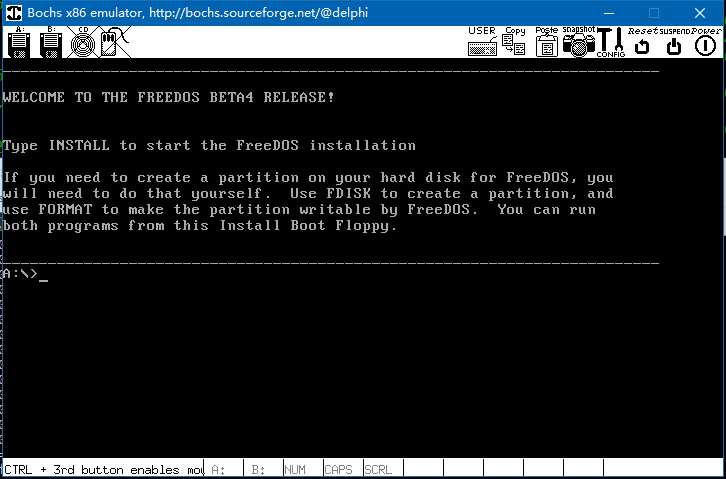
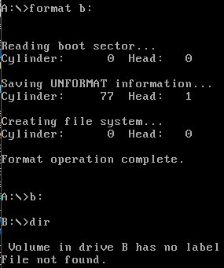
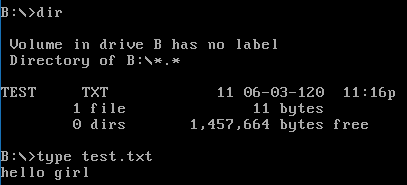
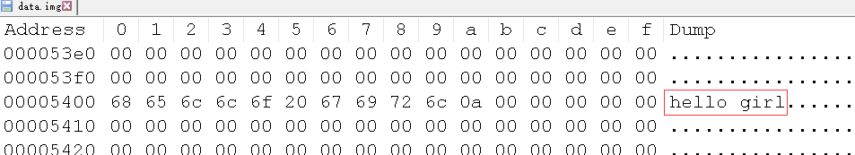
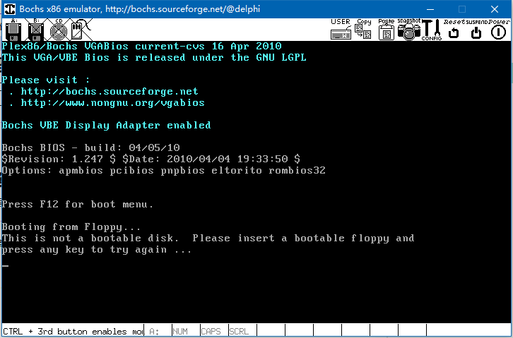

# 主引导程序的扩展
- 主引导程序
    - 继BIOS之后运行的第一个程序
    - 存储于第 0 扇区
    - 以 0x55aa 作为结束标记
    - 大小不超过512字节

- 限制
    主引导程序的代码量不能超过 <font color=red>512</font> 字节！！

- 突破限制的思路
    - 主引导程序
         1. 完成最基本的初始化工作
         2. 从存储介质中加载程序到内存中
         3. 将控制权交由新加载的程序执行
         4. ......

    

- 问题
    主引导程序如何加载存储介质中的其它程序 ?
    > 基于操作系统: 直接指定程序所对应的文件名, 读取就行了(c/c++中文件的读写操作)
    > 但现在没有操作系统, 现在是直接汇编, 运行于硬件的程序
    > 要解决这个问题, 需引进文件系统的概念

- 文件系统
    - 本质 : 存储介质上组织文件数据的方法 (<font color=red>数据组织的方式</font>)
    - 例 : FAT12 文件格式
    
    > FAT1 和 FAT2是两个表, 指明数据间的关系, FAT1 和 FAT2 一样, 相互地备份

- 文件系统示例
    - <font color=red>FAT12</font> 是 DOS 时代的早期文件系统
    - <font color=red>FAT12</font> 结构非常简单，<font color=red>一直沿用于软盘</font>
        > 现在软盘已经基本淘汰了, 但课程是基于虚拟软盘的, 因此依赖 FAT12 文件系统
    - <font color=red>FAT12</font> 的基本组织单位 (三板斧)
        - 字节 (Byte) : 基本数据单位
        - 扇区 (Sector) : 磁盘中的数据单元
            > 比如一个扇区512个字节
        - 簇 (Cluster) : 一个或多个扇区

- 解决方案
    - <font color=red>使用 FAT12 对软盘 (data.img) 进行格式化</font>
    - 编写可执行程序 (Loader), 并将其拷贝到软盘中
    - 主引导程序 (Boot) 在文件系统中查找Loader
    - 将 Loader 复制到内存中，并跳转到入口处执行

- 实验：往虚拟软盘中写入文件
    - 原材料：`FreeDos , Bochs , bximage`
    - 步骤：
        - 创建虚拟软盘data.img
        - 在 FreeDos 中进行格式化（FAT12 )
            > FreeDos : 非常原始的一个操作系统
        - 将data.img挂载到Linux中，并写入文件

# [<u>编程实验 将文件写入虚拟软盘</u>](code/004_master_boot_extend_1)
- 将 FreeDos 相关的文件 (bochsrc freedos.img) 拷贝到 Linux (tool/) 中
- 在 tool/ 中创建一张虚拟软盘 : bximage -> fd -> 1.44 -> data.img
- 编写 bochsrc, 添加 : `floppyb: 1_44="data.img", status=inserted`

    ```
    ###############################################################
    # Configuration file for Bochs
    ###############################################################

    # how much memory the emulated machine will have
    megs: 32

    # filename of ROM images
    romimage: file=/usr/local/share/bochs/BIOS-bochs-latest
    vgaromimage: file=/usr/share/vgabios/vgabios.bin

    # what disk images will be used
    floppya: 1_44=freedos.img, status=inserted
    floppyb: 1_44="data.img", status=inserted

    # choose the boot disk.
    boot: a

    # where do we send log messages?
    # log: bochsout.txt

    # disable the mouse
    mouse: enabled=0

    # enable key mapping, using US layout as default.
    keyboard_mapping: enabled=1, map=/usr/local/share/bochs/keymaps/x11-pc-us.map
    ```
    > 将 data.img 这个虚拟软盘插入到 freedos.img 中去, 并且盘符是 b盘

- 启动 freedos.img : bochs -> 6. Begin simulation -> c
    

- 格式化 ( 成FAT12文件系统 ), 切换到b盘, 查看b盘中的内容, 为空
    

- Ubuntu中重新开一个终端窗口, 将freedos中的 b盘(data.img), 挂载到Ubuntu中的一个目录(~/mnt), 并向目录中写入一个文件, 取消挂载.

    ```
    $ mkdir ~/mnt
    $ sudo mount -o loop data.img ~/mnt
    $ ls ~/mnt
    $ sudo vi ~/mnt/test.txt    // 写入内容 : hello girl
    $ sudo umount /home/delphi/mnt/
    ```

- 重新回到 freedos 系统, 再次查看B盘, 里边多了一个文件, 查看文件里边的内容, 确实为上面所写
    

- 将 data.img 在 windows 中二进制打开,能够查找到所写的字符串
    

# 下一步的工作
- 下一步的工作
    Boot查找目标文件 (Loader), 并读取文件的内容！

- 深入 FAT12 文件系统
    - FAT12 文件系统由<font color=red>主引导区</font>(引导程序)，<font color=red>FAT表</font>(FAT 表1,FAT表2)，<font color=red>根目录项表</font>(目录文件项)和<font color=red>文件数据区</font>(文件数据)组成。

    | 扇区位置 |   长 度    |   内容    |
    | ------- | ---------- | -------- |
    | 0       | 1 (512 B)  | 引导程序  |
    | 1       | 9 (4608 B) | FAT 表1   |
    | 10      | 9 (4608 B) | FAT 表2   |
    | 19      | 14(9728 B) | 目录文件项 |
    | 33      | ----       | 文件数据   |

- FAT12 的主引导区
    - <font color=red>主引导区</font>存储的比较重要的信息是<font color=red>文件系统的类型</font>，文件系统逻辑扇区总数，每簇包含的扇区数，等。<font color=red>主引导区</font>最后以 0X55AA 两个字节作为结束，共占用一个扇区。

    |      标识      | 偏移量 | 类型 | 大小 |  默认值   |                  说明                  |
    | -------------- | ----- | ---- | ---- | --------- | ------------------------------------- |
    | BS_JmpBoot     | 0     | db   | 3    |           | 跳转指令                               |
    | BS_OEMName     | 3     | db   | 8    | MSWIN4.1  | OEM字符串，必须为8个字符，不足以空格填空  |
    | BPB_BytsPerSec | 11    | dw   | 2    | 0x200     | 每扇区字节数                           |
    | BPB_SecPerClus | 13    | db   | 1    | 1         | 每簇占用的扇区数                       |
    | BPB_RsvdSecCnt | 14    | dw   | 2    | 1         | Boot占用的扇区数                       |
    | BPB_NumFATs    | 16    | db   | 1    | 2         | FAT表的记录数                          |
    | BPB_RootEntCnt | 17    | dw   | 2    | 0xE0      | 最大根目录文件数                       |
    | BPB_TotSecl6   | 19    | dw   | 2    | 0xB40     | 逻辑扇区总数                           |
    | BPB_Media      | 21    | db   | 1    | 0xF0      | 媒体描述符                             |
    | BPB_FATSzl6    | 22    | dw   | 2    | 9         | 每个FAT占用扇区数                      |
    | BPB_SecPerTrk  | 24    | dw   | 2    | 0x12      | 每个磁道扇区数                         |
    | BPB_NumHeads   | 26    | dw   | 2    | 2         | 磁头数                                |
    | BPB_HiddSec    | 28    | dd   | 4    | 0         | 隐藏扇区数                             |
    | BPB_TotSec32   | 32    | dd   | 4    | 0         | 如果BPB_TotSecl6是0,则在这里记录扇区总数 |
    | BS_DrvNum      | 36    | db   | 1    | 0         | 中断13的驱动器号                        |
    | BS_Reservedl   | 37    | db   | 1    | 0         | 未使用                                 |
    | BS_BootSig     | 38    | db   | 1    | 0x29      | 扩展引导标志                           |
    | BS_VollD       | 39    | dd   | 4    | 0         | 卷序列号                               |
    | BS_VolLab      | 43    | db   | 11   |           | 卷标，必须是11个字符，不足以空格填充      |
    | BS_FileSysType | 54    | db   | 8    | FAT12     | 文件系统类型，必须是8个字符，不足填充空格  |
    | BOOT_Code      | 62    | db   | 448  | 0x00      | 引导代码，由偏移0字节处的短跳转而来       |
    | END            | 510   | db   | 2    | 0x55,0xAA | 系统引导标识                           |

- 实验 ：读取 data.img 中的文件系统信息
    - 步骤 ：
        - 创建Fat12Header结构体类型
        - 使用文件流读取前512字节的内容
        - 解析并打印相关的信息

# [<u>编程实验 读取FAT12文件系统信息</u>](code/004_master_boot_extend_1)
- 测试的目标 :

    ```
    $ mv data.img ../Fat12Test/
    $ cd ../Fat12Test/
    $ g++ main.cpp
    $ ./a.out
    BS_OEMName: FreeDOS    // 这张虚拟软盘是被FreeDOS格式化的
    BPB_BytsPerSec: 200    // 512字节
    BPB_SecPerClus: 1
    BPB_RsvdSecCnt: 1
    BPB_NumFATs: 2
    BPB_RootEntCnt: e0
    BPB_TotSec16: b40
    BPB_Media: f0
    BPB_FATSz16: 9
    BPB_SecPerTrk: 12
    BPB_NumHeads: 2
    BPB_HiddSec: 0
    BPB_TotSec32: 0
    BS_DrvNum: 1
    BS_Reserved1: 0
    BS_BootSig: 29
    BS_VolID: 0
    BS_VolLab:
    BS_FileSysType: FAT12    // 标识文件系统的类型
    Byte 510: 55
    Byte 511: aa
    ```
- 猜测 :
    freedos在格式化这张虚拟软盘的时候, 在第0扇区不但写入了 fat12相关的这些数据, 并且塞了个主引导程序进去

- 验证

    更改 data.img 为启动盘

    ```
    $ cp ../tool/bochsrc .
    $ vi bochsrc
    $ cat bochsrc
    ###############################################################
    # Configuration file for Bochs
    ###############################################################

    # how much memory the emulated machine will have
    megs: 32

    # filename of ROM images
    romimage: file=/usr/local/share/bochs/BIOS-bochs-latest
    vgaromimage: file=/usr/share/vgabios/vgabios.bin

    # what disk images will be used
    #floppya: 1_44=freedos.img, status=inserted
    floppya: 1_44="data.img", status=inserted

    # choose the boot disk.
    boot: a

    # where do we send log messages?
    # log: bochsout.txt

    # disable the mouse
    mouse: enabled=0

    # enable key mapping, using US layout as default.
    keyboard_mapping: enabled=1, map=/usr/local/share/bochs/keymaps/x11-pc-us.map
    ```

    启动bochs : bochs -> 6 -> c
    
    > `this is not a bootable disk ...` 就是freedos写进去的主引导程序(仅打印这句提示语句)

# 实验结论
- FreeDos中的format程序在格式化软盘的时候<font color=red>自动在第0扇区生成了一个主引导程序</font>，这个主引导程序只打印一个字符串
- <font color=red>文件格式和文件系统都是用于定义数据如何存放的规则</font>，只要遵循这个规则就能够成功读写目标数据

# 小结
- 主引导程序的代码量<font color=red>不能超过 512 字节</font>
- <font color=red>可以通过主引导程序加载新程序的方式突破限制</font>
- 加载新程序需要依赖于文件系统
- FAT12 是一种早期用于软盘的简单文件系统
- FAT12 文件系统的<font color=#d0d>重要信息存储于 0 扇区</font>
