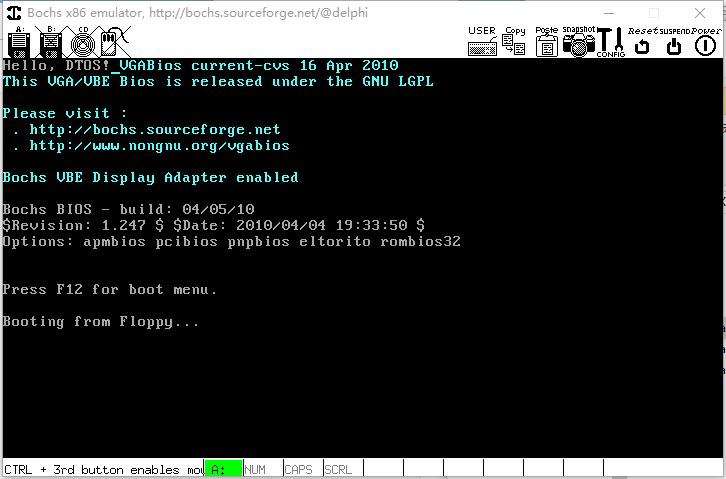
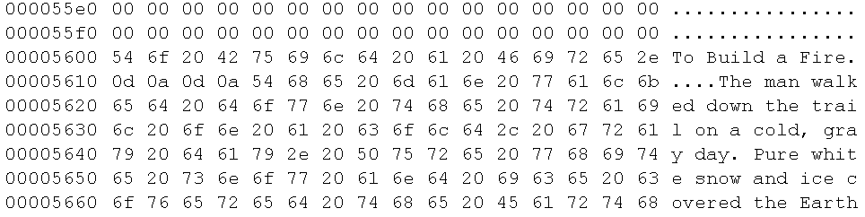
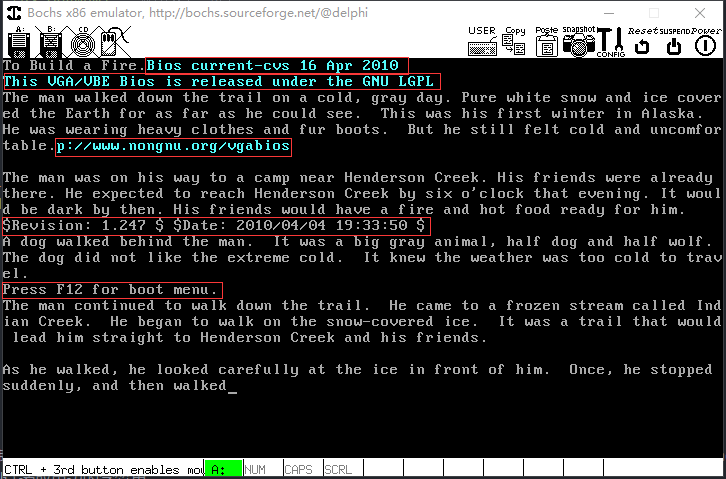

# 突破 512 字节的限制

- 突破限制的预备工作(两个功能函数)


# 创建字符串打印函数
- 问题
    主引导程序中<font color=red>如何进行字符串打印</font>？
    > 前面的程序, 是利用了字符的打印来实现字符串打印, 并没有一次性打印一个字符串, 是通过循环的方式将字符串中的数据逐个打印出来实现的
    > 要实现一次性打印,需利用BIOS中的中断

- BIOS中的字符串打印
    - 指定打印参数 ( <font color=red>AX = 0x1301, BX = 0x0007</font> )
        > 规定
    - 指定字符串的内存地址 ( <font color=#d0d>ES:BP = 串地址</font> )
        > 按段地址以及段内偏移地址的方式来指定目标字符串的内存地址
        > 前面讲过: 在汇编语言中, 使用过段地址加上段内偏移地址的方式来确定最终的内存地址的
    - 指定字符串的长度 ( <font color=#d00>CX = 串长度</font> )
    - 中断调用 ( `int 0x10` )

- 字符串打印示例

    ```x86asm
    ; 指定字符串地址
    mov ax, msg    ; 字符串在内存中的位置, msg:代表字符串在内存中某个段内的偏移地址
    mov bp, ax     ; 再赋给 bp
    mov ax, ds     ; 指定段地址. 为什么不直接 mov es, ds ???
    mov es, ax     ; 在这个示例中,我们的目标字符串在 es 段中

    ; 指定字符串长度
    mov cx, 6

    ; 指定打印参数
    mov ax, 0x1301
    mov bx, 0x0007

    int 0x10
    ```

- 汇编小贴士
    - 汇编中可以定义函数（函数名使用<font color=red>标签</font>定义）
        - `call function` (调用函数, function : 函数的入口地址)
        - 函数体的最后—条指令为 <font color=red>ret</font> (返回指令)
    - 如果代码中定义了函数，那么需要定义栈空间
        - <font color=#d0d>用于保存关键寄存器的值</font>
        - 栈顶地址通过 <font color=red>sp</font> 寄存器保存
        > 下面编程看到
    - 汇编中的 "常量定义" (`equ`)
        - 用法：`Const equ 0x7c00    ;#define Const 0x7c00`
        > Const 就是汇编语言中的一个符号, equ 表示要将这个符号定义为一个常量值
        - 与 `dx (db, dw, dd)`的区别：
            - `dx` 定义占用相应的内存空间
            - `equ` 定义<font color=red>不会占用</font>任何内存空间
            > 可理解为 C语言中定义变量与定义宏之间的差异

# [<u>编程实验 定义打印函数 print</u>](code/006_突破512字节的限制_上)
1. 创建makefile简化工作
    > 编写主引导程序的代码, 编译, 得到二进制文件(OUT), 创建虚拟软盘文件, 将主引导程序二进制代码烧写到虚拟软盘的第0个扇区, 然后才能到 bochs 中运行.

    ```makefile
    .PHONY : all clean rebuild

    SRC := boot.asm
    OUT := boot.bin
    IMG := data.img

    RM := rm -fr

    all : $(OUT) $(IMG)
    	dd if=$(OUT) of=$(IMG) bs=512 count=1 conv=notrunc
    	@echo "Success!"

    $(IMG) :
    	bximage $@ -q -fd -size=1.44

    $(OUT) : $(SRC)
    	nasm $^ -o $@

    clean :
    	$(RM) $(IMG) $(OUT)

    rebuild :
    	@$(MAKE) clean
    	@$(MAKE) all
    ```

2. 编写主引导程序汇编代码 : boot_v1.asm
    执行: bochs -> 6 -> c[ontinue] : (未做清屏操作, 所以是如下打印)
    

3. 优化主引导程序的汇编代码, 封装print函数 : boot_v2.asm
    打印定义的整个字符串
    

# 软盘读取
- 问题
    主引导程序中<font color=red>如何读取指定扇区处的数据</font>？

- 软盘的构造
    - 一个软盘有2个盘面，每个盘面对应1个磁头
    - 每一个盘面被划分为若干个圆圏，成为柱面（磁道）
    - 每一个柱面被划分为若干个扇区，每个扇区512字节

    

- 3.5寸软盘的数据特性
    - 每个盘面一共80个拄面 (编号为0 - 79)
    - 每个拄面有18个扇区 (编号为1 - 18)
    - 存储大小：
        2 * 80 * 18 * 512 = 1474560 Bytes = 1440 KB
        > 2个盘面, 80个柱面, 18个扇区, 512字节
- 软盘数据的读取(如何定位我们感兴趣的扇区?)
    > 前面所使用的扇区号是`逻辑扇区号`, 逻辑扇区号是线性的, 从0开始逐步增大的. 在真正的软盘物理结构上, 不是这样线性编号, 是以下面的三元组来编号的
    - 软盘数据以扇区（<font color=red>512字节</font>）为单位进行读取
    - 指定数据所在位置的<font color=red>磁头号，拄面号，扇区号</font>
    - 计算公式：
    
    > 柱面扇区数是18, 得到的余数是物理扇区号, 商和1相与就是磁头号(总共就两个磁头)

- BIOS中的软盘数据读取 (int 0x13)
    
    > 读数据时, AH寄存器的值是0x02, 这是规定好的

- 软盘数据读取流程
    


- 汇编小贴士
    - 汇编中的<font color=red>16位</font>除法操作（div )
        - 被除数放到 AX 寄存器
        - 除数放到通用寄存器或内存单元（因为是16位除法, 所以除数必须是<font color=red>8位</font>）
        - 结果：<font color=red>商位于AL, 余数位于 AH</font>

# [<u>编程实验 磁盘数据的读取</u>](code/006_突破512字节的限制_上)(boot_v3.asm)
1. 编写重置软驱函数 ResetFloppy

    ```x86asm
    ; 重置软驱
    ; no parameter
    ResetFloppy:
        push ax ; 在栈中备份
        push dx

        mov ah, 0x00
        mov dl, [BS_DrvNum] ; DL寄存器:当前的燃区号, BS_DrvNum:在fat12文件系统的头信息中定义了软驱的编号
        int 0x13

        pop dx ; 出栈与进栈的顺序要相反
        pop ax

        ret
    ```

2. 编写读取软驱数据的函数 ReadSector

    ```x86asm
    ; 读取软驱数据
    ; ax    --> logic sector number
    ; cx    --> number of sector
    ; es:bx --> target address
    ReadSector:
        push bx
        push cx
        push dx
        push ax

        call ResetFloppy

        push bx ; 下面修改了bx寄存器的值, 意味着目标内存的地址被改变了. 因此此处压栈保存, 此处遗漏可反汇编调试
        push cx

        mov bl, [BPB_SecPerTrk] ; 除数:18, 每个柱面所拥有的扇区数
        div bl ; 商在al, 余数在ah
        mov cl, ah
        add cl, 1 ; 扇区号
        mov ch, al
        shr ch, 1 ; 柱面号
        mov dh, al
        and dh, 1 ; 磁头号
        mov dl, [BS_DrvNum] ; 驱动器号:A盘

        pop ax ; 将cx寄存器的值出栈, 放到ax寄存器中, 这样ax中就有了我们要读取的扇区的数量
        pop bx

        mov ah, 0x02 ; 读的时候ah = 0x02, 这是规定好的

    read:
        int 0x13
        jc read ; 执行0x13号中断的时候有可能读取失败. 若错误标志位被设置, 则跳转重读

        pop ax
        pop dx
        pop cx
        pop bx

        ret
    ```

3. 进行测试
    3.1 使用上节制作的 [<u>data.img</u>](code/005_master_boot_extend_2/Fat12Test) , 在windows中用 notepad++ 以十六进制方式打开, 找到之前写入虚拟软盘的文件的内容. 我们来做测试读取里边的字符串
    
    确定这个字符串位于哪个扇区 : 22016(0x5600) / 512 = 43, 即,位于第43扇区的第0字节处.

    3.2 实验运行
    ```
    1. cd 006_突破512字节的限制_上
    2. 更改makefile, 汇编源码改为 : boot_v3.asm
    3. make clean
    4. cp ../005_master_boot_extend_2/Fat12Test/data.img .
    5. make
    6. 运行bochs
    ```
    > copy2个扇区, 打印1000个字节的实验结果 (红框为原有的系统的打印)
    > 

    3.3 汇编代码的调试手段
    上面的 ReadSector, 在计算 扇区号, 柱面号, 磁头号等信息时, 若未保存bx寄存器(下面注释的两行汇编), 导致打印异常, 该如何调试?
    ```x86asm
    ; 读取软驱数据
    ; ax    --> logic sector number
    ; cx    --> number of sector
    ; es:bx --> target address
    ReadSector:
        push bx
        push cx
        push dx
        push ax

        call ResetFloppy

        ;push bx ; 下面修改了bx寄存器的值, 意味着目标内存的地址被改变了. 因此此处压栈保存, 此处遗漏可反汇编调试
        push cx

        mov bl, [BPB_SecPerTrk] ; 除数:18, 每个柱面所拥有的扇区数
        div bl ; 商在al, 余数在ah
        mov cl, ah
        add cl, 1 ; 扇区号
        mov ch, al
        shr ch, 1 ; 柱面号
        mov dh, al
        and dh, 1 ; 磁头号
        mov dl, [BS_DrvNum] ; 驱动器号:A盘

        pop ax ; 将cx寄存器的值出栈, 放到ax寄存器中, 这样ax中就有了我们要读取的扇区的数量
        ;pop bx

        mov ah, 0x02 ; 读的时候ah = 0x02, 这是规定好的

    read:
        int 0x13
        jc read ; 执行0x13号中断的时候有可能读取失败. 若错误标志位被设置, 则跳转重读

        pop ax
        pop dx
        pop cx
        pop bx

        ret
    ```

    对文件`boot_v3.asm`编译生成的二进制文件进行反汇编 `boot.txt` , 从0x7c00开始反编译, 因为我们的程序是从这个地址开始执行的
    ```
    ndisasm -o 0x7c00 boot.bin > boot.txt
    ```
    对照汇编源码, 对于 ReadSector 函数, 有4个push指令, 在反编译的结果里边找到是第57行, push完后就进行函数调用. 因此 0x00007C78 这个地址就是 ReadSector 这个函数的入口地址, 因此我们就可以进行断点调试了
    启动 bochs, 设置断点 : bochs -> 6

    ```
    <bochs:1> break 0x00007C78
    <bochs:2> info break
    Num Type           Disp Enb Address
      1 pbreakpoint    keep y   0x00007c78
    <bochs:3> c    // 执行到上面设置的断点
    00000003305i[BIOS ] $Revision: 1.247 $ $Date: 2010/04/04 19:33:50 $
    00000318042i[KBD  ] reset-disable command received
    00000436212i[VBIOS] VGABios $Id$
    00000436283i[VGA  ] VBE known Display Interface b0c0
    00000436315i[VGA  ] VBE known Display Interface b0c4
    00000436984i[VBIOS] VBE Bios $Id$
    00000600000i[XGUI ] charmap update. Font Height is 16
    00000754538i[BIOS ] Starting rombios32
    00000755035i[BIOS ] Shutdown flag 0
    00000755716i[BIOS ] ram_size=0x02000000
    00000756194i[BIOS ] ram_end=32MB
    00000796814i[BIOS ] Found 1 cpu(s)
    00000816083i[BIOS ] bios_table_addr: 0x000fbc18 end=0x000fcc00
    00000828760i[BIOS ] bios_table_cur_addr: 0x000fbc18
    00012943036i[BIOS ] Booting from 0000:7c00
    (0) Breakpoint 1, 0x00007c78 in ?? ()
    Next at t=12943107
    (0) [0x00007c78] 0000:7c78 (unk. ctxt): push bx                   ; 53 // 这是接下来要执行的语句
    <bochs:4>
    ```

    我们要从 `boot_v3.asm` 的第100行 `mov bl, [BPB_SecPerTrk]` 开始进行调试, 因此从 `boot.txt` 中找到该语句的地址为 `0x00007C81` , 因此再次设置断点

    ```
    <bochs:4> break 0x00007C81
    <bochs:5> info break
    Num Type           Disp Enb Address
      1 pbreakpoint    keep y   0x00007c78
      2 pbreakpoint    keep y   0x00007c81
    <bochs:6> c // 继续执行
    (0) Breakpoint 2, 0x00007c81 in ?? ()
    Next at t=12943329
    (0) [0x00007c81] 0000:7c81 (unk. ctxt): mov bl, byte ptr ds:0x7c18 ; 8a1e187c
    <bochs:7> step // 单步执行
    Next at t=12943330
    (0) [0x00007c85] 0000:7c85 (unk. ctxt): div al, bl                ; f6f3
    <bochs:8> s // 单步执行
    Next at t=12943331
    (0) [0x00007c87] 0000:7c87 (unk. ctxt): mov cl, ah                ; 88e1
    <bochs:9> s
    Next at t=12943332
    (0) [0x00007c89] 0000:7c89 (unk. ctxt): add cl, 0x01              ; 80c101
    <bochs:10> s
    Next at t=12943333
    (0) [0x00007c8c] 0000:7c8c (unk. ctxt): mov ch, al                ; 88c5
    <bochs:11> s
    Next at t=12943334
    (0) [0x00007c8e] 0000:7c8e (unk. ctxt): shr ch, 1                 ; d0ed
    <bochs:12> s
    Next at t=12943335
    (0) [0x00007c90] 0000:7c90 (unk. ctxt): mov dh, al                ; 88c6
    <bochs:13> s
    Next at t=12943336
    (0) [0x00007c92] 0000:7c92 (unk. ctxt): and dh, 0x01              ; 80e601
    <bochs:14> s
    Next at t=12943337
    (0) [0x00007c95] 0000:7c95 (unk. ctxt): mov dl, byte ptr ds:0x7c24 ; 8a16247c
    <bochs:15> s // 执行完这句, 就成功的将逻辑扇区号分解为三元组了
    Next at t=12943338
    (0) [0x00007c99] 0000:7c99 (unk. ctxt): pop ax                    ; 58
    <bochs:16> reg // 打印关键寄存器的值, 可计算确认值是否符合预期
    eax: 0x00000702 1794
    ecx: 0x00000108 264    // cl寄存器才是物理扇区号? 此处讲解有误?
    edx: 0x00000000 0
    ebx: 0x00007c12 31762
    esp: 0x00007bf2 31730
    ebp: 0x00000000 0
    esi: 0x000e32f8 930552
    edi: 0x0000ffac 65452
    eip: 0x00007c99
    eflags 0x00000046: id vip vif ac vm rf nt IOPL=0 of df if tf sf ZF af PF cf
    <bochs:17>
    ```

# 小结
- 当汇编代码中定义了函数，那么也需要定义栈空间
- 读取数据前，<font color=#d0d>逻辑扇区号需要转化为磁盘的物理位置</font>
- 物理软盘上的数据位置由<font color=red>磁头号，柱面号，扇区号</font>唯一确定
- 软盘数据以扇区（<font color=red>512字节</font>）为单位进行读取
